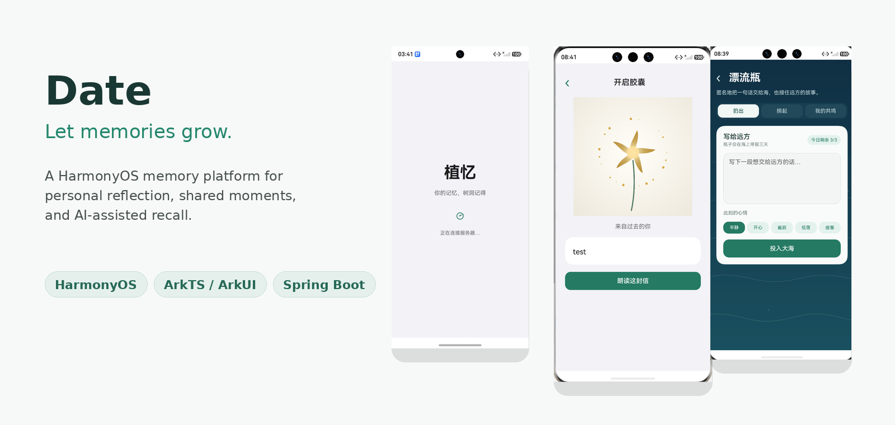
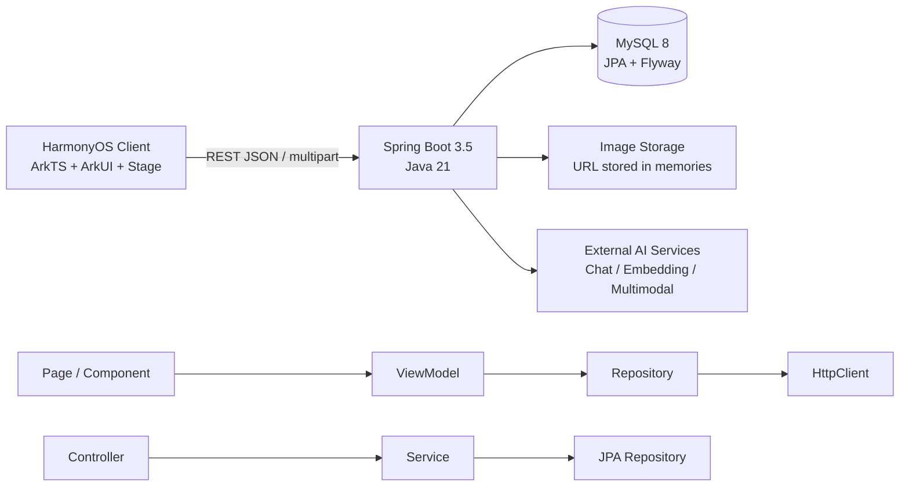

<a id="top"></a>

<p align="center">
  
</p>

<h1 align="center">Date</h1>

<p align="center">
  <strong>Let memories grow.</strong><br/>
  An open-source HarmonyOS memory platform for personal reflection, small-group co-creation, and AI-assisted recall.
</p>

<p align="center">
  <a href="#overview">Overview</a> ·
  <a href="#feature-tour">Feature Tour</a> ·
  <a href="#core-features">Core Features</a> ·
  <a href="#privacy-security">Privacy &amp; Security</a> ·
  <a href="#architecture">Architecture</a> ·
  <a href="#tech-stack">Tech Stack</a> ·
  <a href="#getting-started">Getting Started</a> ·
  <a href="#contributing">Contributing</a>
</p>

---

<a id="overview"></a>

## 🌿 Overview

**Date** is an open-source project that explores a simple question:

> What if digital memories could grow, connect, and return to us — instead of disappearing into photo galleries, chat histories, and endless feeds?

Traditional note-taking tools are good at **saving** information. Date is designed around a larger loop:

<p align="center">
  <strong>Record → Organize → Co-create → Revisit</strong>
</p>

Users can save text, photos, moods, dates, and hours; organize memories through a dynamic **Memory Tree**; build private shared spaces through **Tree Holes** and **Common Day**; and revisit memories through AI summaries, retrieval, time capsules, audio channels, desktop cards, and other interactions.

The project is open source so developers can learn from it, experiment with it, and contribute to it.

> **Project status:** active student project / local development demo. It is not currently operated as a public production service.

---

<a id="feature-tour"></a>

## ✨ Feature Tour

### ⏳ Time Capsule

Write or dictate something for your future self, seal it until a chosen time, and let the app reveal and read it when the capsule opens.

### 🌊 Drift Bottle

A lightweight anonymous interaction where users can send a short thought into the "sea", retrieve eligible bottles, and respond with resonance while the API avoids exposing author identity.

### 🎙️ Memory Radio

Static memories are reorganized into four listenable channels, driven by time, mood, and whether a memory contains a photo. HarmonyOS Core Speech TTS turns selected memories into spoken playback.

### 🌈 AI-guided Image Enhancement

The multimodal model does **not** directly rewrite pixels. It analyzes the selected image and generates structured parameters; a deterministic computer-vision pipeline performs the actual editing.

---

<a id="core-features"></a>

## 🧩 Core Features

### 🌳 Memory Tree

The Memory Tree is more than a decorative visualization. Each leaf corresponds to a real memory and acts as an interactive navigation entry.

The growth engine uses:

- Stable ordering by creation time and memory ID
- A repeatable user-derived pseudo-random seed
- Golden-angle distribution (`~2.399963 rad`)
- Collision detection with bounded retries
- Iterative branch growth
- Nearest-branch attachment
- Canvas animation and hit testing
- Semantic styling based on mood and image presence

### 📝 Rich Memory Capture

A memory can include:

- Text
- Photos
- Mood
- Date
- Hour
- Author and shared-space relationships

On HarmonyOS, Photo Picker and Image Kit are used to safely decode and prepare media. Images are compressed on-device before upload; the server validates file characteristics, assigns UUID-based filenames, and stores image URLs rather than database BLOBs.

### 🕳️ Tree Holes

Tree Holes are private spaces for small groups such as close friends, couples, families, and travel companions.

- Creators automatically become members
- Other users join through invitation codes
- Membership is checked again before shared memories are read or written
- Shared records retain author, date, hour, text, and image information

The goal is not to create another public social feed. It is to make shared memory spaces smaller and more intentional.

### 🕰️ Common Day

Common Day reorganizes memories from the same shared space by **date + hour**, producing a 0–23 hour timeline.

For example, different members can record departure, sightseeing, lunch, and the trip home at different times, allowing one day to be reconstructed from multiple perspectives.

> Poster export for Common Day is a planned integration rather than a completed module.

### ✨ Memory Summary Agent

Users can trigger an AI-generated memory card from recent memories.

The service:

1. Scans incrementally from the previous summary card
2. Builds a chronological memory context
3. Requests structured JSON from the model
4. Stores the generated title, summary, emotion tags, time range, and memory count
5. Falls back gracefully when JSON parsing or model access fails

### 🔎 Rememberer - Retrieval-Augmented Recall

Rememberer is a RAG-style question-answering experience over memories inside a Tree Hole.

The backend first verifies membership, then retrieves the **Top 5** relevant memories before asking the model to answer from that context. Sources are returned with the answer so the result remains traceable.

Two retrieval routes are supported:

- **Embedding available:** vector retrieval with cosine similarity
- **Embedding unavailable:** Chinese character/bigram keyword scoring fallback

The agent is explicitly constrained to answer from retrieved context and to admit when the available memories are insufficient.

### 🎨 AI-assisted Image Editing

The editing pipeline separates **model judgment** from **pixel execution**:

1. The user selects one image
2. The client decodes and compresses it to a manageable size
3. A multimodal model analyzes the image
4. The model returns a structured set of enhancement parameters
5. A deterministic CV pipeline executes contrast, brightness, denoising, sharpening, and HSL vibrance operations
6. Invalid model output falls back to safe default parameters

This design keeps the output controllable and debuggable while still letting the model adapt parameters to the image.

### 🎙️ Memory Radio

Four channels turn stored memories into listenable experiences:

| Channel | Selection rule |
|---|---|
| Time Rewind | newest memories gradually move toward the past |
| Sunshine Radio | positive moods such as happiness and excitement |
| Memory Gallery | memories containing photos |
| Midnight Tree Hole | quiet, tired, calm, or low moods |

HarmonyOS Core Speech TTS reads the generated narration and memory content, while lifecycle callbacks keep playback state synchronized with the UI.

### ⏳ Time Capsule

Time Capsule combines native voice capabilities with server-side time validation:

- Core Speech Kit supports real-time speech-to-text input
- Recognized text remains editable
- `openAt` is checked against server time
- Early opening is rejected by the backend
- Opening triggers a Canvas flower animation before speech playback
- Recognition, timers, and TTS are stopped when the page exits

### 🌊 Drift Bottle

Drift Bottle explores anonymous social interaction with backend-enforced limits and database constraints.

The current design includes:

- 3-day validity
- Daily send/retrieve limits
- Exclusion of the user's own, already-retrieved, and expired bottles
- One resonance per user per bottle
- Anonymous response DTOs that do not expose the author identity
- Database uniqueness constraints to prevent duplicate actions

### 🧩 HarmonyOS Desktop Card

Form Kit allows recent photo memories to appear outside the app:

- Recent photos are prepared in the application sandbox
- Data is cached for synchronous first render
- Image file descriptors are passed through `FormBindingData`
- The card displays a 2×2 recent-photo layout
- `updateForm` refreshes content
- Card actions can route the user back into the main app

### 🖼️ Image-to-Draft Writing

The user can choose an image and time, then ask the model to generate an editable first-person memory draft.

The client never stores the external model API key. The backend acts as the proxy, validates the request, sends only the selected image/context, and returns a draft that the user can edit before publishing.

---

<a id="privacy-security"></a>

## 🔒 Privacy & Security Design

Date deals with personal memories, so privacy boundaries are part of the architecture rather than a UI-only concern.

The project uses multiple layers of isolation:

1. **Client session** — token stored through Preferences and attached to requests
2. **Spring Security** — JWT authentication restores the current identity
3. **Service authorization** — ownership, Tree Hole membership, and creator roles are checked server-side
4. **Database constraints** — foreign keys and uniqueness constraints protect consistency

For AI calls, the intended architecture is:

```text
HarmonyOS client
      -> Spring Boot backend
      -> permission check + limited context
      -> external AI service
```

External API keys remain on the server rather than in the HarmonyOS application.

> **Important:** the repository is intended for local development and learning.
> It has no default database password, JWT secret, or seeded user accounts, and
> it listens on loopback by default. Before allowing network access, provide
> secrets through the environment, review media permissions, and perform a
> dedicated deployment security review.

---

<a id="architecture"></a>

## 🏗️ Architecture



### 📱 HarmonyOS native capabilities

- Photo Picker
- Image Kit
- Canvas
- Core Speech Kit
- Notification Kit
- Form Kit
- Preferences
- Ability lifecycle APIs

---

<a id="tech-stack"></a>

## 🛠️ Tech Stack

### 📱 Client

- HarmonyOS
- ArkTS
- ArkUI
- Stage model
- DevEco Studio
- REST / multipart HTTP communication

### ☕ Backend

- Java 21
- Spring Boot 3.5
- Spring Security
- JWT authentication
- Spring Data JPA
- Flyway
- Maven

### 🧠 Data & AI

- MySQL 8
- Local H2 demo/testing profile
- File-based image storage
- External chat / embedding / multimodal AI services through the backend

---

## 🗂️ Repository Structure

```text
Date/
|-- AppScope/                 # HarmonyOS app-level resources
|-- entry/                    # HarmonyOS client
|   `-- src/main/ets/
|       |-- components/
|       |-- constants/
|       |-- models/
|       |-- pages/
|       |-- repositories/
|       |-- services/
|       `-- viewmodels/
|-- server/                   # Spring Boot backend
|   |-- scripts/
|   |-- src/main/
|   |-- src/test/
|   `-- pom.xml
`-- assets/                   # Public README artwork only
```

---

<a id="getting-started"></a>

## 🚀 Getting Started

### 1. Clone your fork or repository

```bash
git clone <repository-url>
cd Date
```

### 2. Start the backend - quick local demo

Requirements:

- Java 21
- Maven 3.9+

```bash
cd server
mvn spring-boot:run "-Dspring-boot.run.profiles=demo"
```

Before starting, provide `ZHIYI_JWT_SECRET` through the environment using a
random value of at least 32 characters. The backend listens only on
`127.0.0.1:8080` by default.

Swagger UI:

```text
http://localhost:8080/swagger-ui.html
```

The demo profile uses a local H2 database and is intended only for local
development/testing. It does not create default users or passwords; register a
test account through the client or API.

### 3. Start with MySQL

Requirements:

- MySQL 8
- Java 21
- Maven 3.9+

Initialize your local database using:

```text
server/scripts/create-local-db.sql
```

Set environment variables using your own values:

```text
ZHIYI_DB_URL
ZHIYI_DB_USERNAME
ZHIYI_DB_PASSWORD
ZHIYI_JWT_SECRET
```

Then run:

```bash
cd server
mvn spring-boot:run
```

Flyway manages database migrations automatically.

### 4. Run the HarmonyOS client

1. Open the repository in **DevEco Studio**.
2. Start the backend.
3. Make sure the phone/emulator can reach the backend.
4. Configure the server address through the project's API configuration/local server settings.
5. Build and run the `entry` module.

For physical-device testing, the phone and development computer normally need to be on the same reachable network unless you use another local networking setup.

---

## ✅ Tests

Backend tests can be run with:

```bash
cd server
mvn test
```

The test setup uses an isolated H2 database and covers important flows such as authentication protection, registration conflicts, invitation-based Tree Hole joining, member isolation, and Common Day queries.

---

## 💡 Engineering Highlights

This project is also an engineering experiment in combining deterministic software systems with AI-assisted behavior.

- **Memory visualization:** deterministic growth logic rather than random decoration
- **Authorization:** identity + resource-level membership/ownership checks
- **Media pipeline:** temporary URI → decode → compress → multipart → validation → URL persistence
- **RAG fallback:** embeddings when available, keyword scoring when not
- **AI output boundaries:** structured JSON, context limitations, parser fallbacks
- **Image editing:** model selects parameters; deterministic CV performs edits
- **Lifecycle correctness:** speech, timers, and playback stop when the page exits
- **Native HarmonyOS integration:** speech, cards, notifications, media, Canvas, and app lifecycle

---

## 🌱 Project Motivation

Digital memories are easy to save but surprisingly difficult to organize, rediscover, and preserve together with other people. Date explores ways to make those memories easier to understand, revisit, and share intentionally.

By keeping Date open source, we aim to make the project easier to understand, test, extend, and maintain while learning from other developers.

We are especially interested in using modern coding tools such as Codex to help us:

- Refactor and understand a growing codebase
- Find and fix bugs
- Expand automated tests
- Improve documentation
- Review frontend/backend changes
- Make issues easier for new contributors to approach
- Learn better software-engineering practices while continuing the project

---

## 🗺️ Roadmap

The course version established a broad functional prototype. The next stage is about making it more reliable and sustainable.

- [ ] Strengthen privacy and security review
- [ ] Add a local privacy lock
- [ ] Improve offline behavior
- [ ] Improve upload reliability / resumable media transfer
- [ ] Expand automated test coverage
- [ ] Add CI/CD
- [ ] Improve Memory Tree interaction and visualization
- [ ] Finish Common Day poster export
- [ ] Add anniversary reminders
- [ ] Add monthly memory summaries
- [ ] Improve personalization
- [ ] Improve accessibility
- [ ] Add internationalization
- [ ] Improve contributor documentation

---

<a id="contributing"></a>

## 🤝 Contributing

Contributions are welcome, including from other students and first-time open-source contributors.

Useful ways to contribute include:

- Report a bug
- Suggest a feature
- Improve documentation
- Add tests
- Improve UI/UX
- Refactor a module
- Improve accessibility
- Review security/privacy behavior
- Open a pull request

For larger changes, opening an Issue first is recommended so the design can be discussed before implementation.

---

## 📄 License

This repository is released under the **MIT License**. See [`LICENSE`](LICENSE).

---

<p align="center">
  <strong>Date</strong><br/>
  Not every meaningful moment needs an audience.<br/>
  Some moments simply deserve to be remembered.
</p>

<p align="center"><a href="#top">Back to top ↑</a></p>
